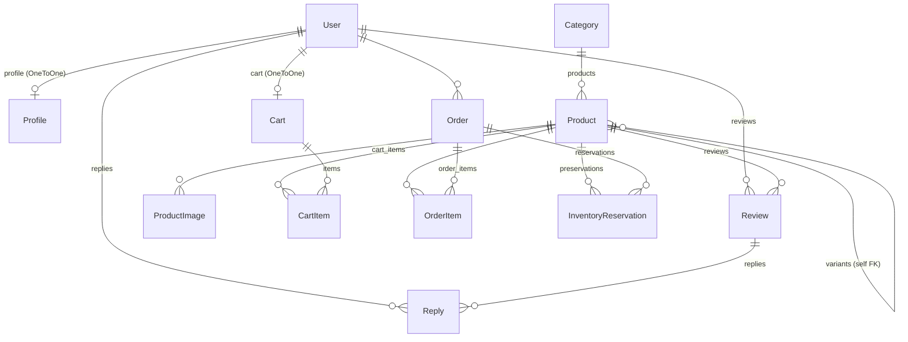

# Uzi Store — مستند کامل معماری و وضعیت پروژه

> این فایل از روی خواندن کامل سورس تولید شده (همه‌ی ۷۸ فایل پایتون در `src/`، تنظیمات، Docker و env).
> تاریخ تولید: ۱۴۰۵/۰۷/۱۳ (2026-10-05) — برنچ `dev`
>
> هدف: بفهمی «کی به کیه»، چه چیزی هست، چه چیزی کار می‌کند، چه چیزی شکسته است، و بعدش تصمیم بگیری.

---

## فهرست

1. [خلاصه‌ی یک‌پاراگرافی](#۱-خلاصهی-یکپاراگرافی)
2. [استک فنی](#۲-استک-فنی)
3. [ساختار پوشه‌ها](#۳-ساختار-پوشهها)
4. [نکته‌ی حیاتی: نام اپ‌ها vs لیبل اپ‌ها](#۴-نکتهی-حیاتی-نام-اپها-vs-لیبل-اپها)
5. [مدل داده (ERD)](#۵-مدل-داده-erd)
6. [شرح مدل‌ها فیلد به فیلد](#۶-شرح-مدلها-فیلد-به-فیلد)
7. [نقشه‌ی کامل API](#۷-نقشهی-کامل-api)
8. [جریان‌های اصلی کسب‌وکار](#۸-جریانهای-اصلی-کسبوکار)
9. [احراز هویت و مجوزها](#۹-احراز-هویت-و-مجوزها)
10. [کش](#۱۰-کش)
11. [تسک‌های پس‌زمینه (Celery)](#۱۱-تسکهای-پسزمینه-celery)
12. [درگاه پرداخت و پیامک](#۱۲-درگاه-پرداخت-و-پیامک)
13. [Rate limiting](#۱۳-rate-limiting)
14. [پنل ادمین جنگو](#۱۴-پنل-ادمین-جنگو)
15. [قالب‌ها (Templates)](#۱۵-قالبها-templates)
16. [زیرساخت و استقرار](#۱۶-زیرساخت-و-استقرار)
17. [وضعیت تست‌ها](#۱۷-وضعیت-تستها)
18. [جدول وضعیت هر قابلیت](#۱۸-جدول-وضعیت-هر-قابلیت)
19. [فهرست کامل نواقص](#۱۹-فهرست-کامل-نواقص)
20. [چیزهایی که برای یک فروشگاه واقعی هنوز وجود ندارند](#۲۰-چیزهایی-که-برای-یک-فروشگاه-واقعی-هنوز-وجود-ندارند)
21. [مسیر پیشنهادی](#۲۱-مسیر-پیشنهادی)

---

## ۱. خلاصه‌ی یک‌پاراگرافی

Uzi Store یک بک‌اند فروشگاه اینترنتی با Django 5.2 + DRF است که روی **۶ اپ** تقسیم شده: `accounts` (کاربر و OTP)، `dashboard` (پروفایل)، `product` (محصول/دسته/نظر)، `cart` (سبد خرید)، `order` (سفارش/پرداخت/رزرو انبار) و `common` (ابزار HTTP مشترک). ویژگی معماری متمایزش **سیستم رزرو موجودی** است: هنگام ثبت سفارش موجودی واقعی کم نمی‌شود، بلکه یک `InventoryReservation` با انقضای ۱۵ دقیقه ساخته می‌شود و `available_stock()` موجودی قابل فروش را به‌صورت `stock - رزروهای فعال` حساب می‌کند. موجودی واقعی فقط بعد از تأیید پرداخت توسط درگاه کم می‌شود. مدل محصول از **variant دوسطحی** (محصول پایه → واریانت) پشتیبانی می‌کند و فقط واریانت‌ها قابل افزودن به سبد هستند. کش یک لایه‌ی `FallbackCache` سفارشی دارد که اگر Redis بیفتد به حافظه‌ی محلی سوییچ می‌کند.

**اما:** پروژه در حال حاضر در چند نقطه‌ی حیاتی اجرا نمی‌شود — ثبت‌نام، پروفایل، و پنل مدیر خرابند. بخش [۱۹](#۱۹-فهرست-کامل-نواقص) دقیق توضیح می‌دهد.

---

## ۲. استک فنی

| لایه | انتخاب | نسخه |
|---|---|---|
| فریم‌ورک | Django | 5.2 |
| API | Django REST Framework | 3.17.0 |
| احراز هویت | djangorestframework-simplejwt | 5.5.1 |
| دیتابیس | PostgreSQL (psycopg binary) | 3.3.4 / PG 17 |
| کش | Redis + django-redis | 7.4.0 / 6.0.0 |
| صف | Celery + django-celery-beat | 5.6.3 / 2.9.0 |
| وب‌سرور | Gunicorn + WhiteNoise | 23.0.0 / 6.12.0 |
| شماره تلفن | django-phonenumber-field + phonenumbers | 8.4.0 / 9.0.33 |
| تصویر | Pillow | 12.2.0 |
| تنظیمات | django-environ | 0.13.0 |
| CORS | django-cors-headers | 4.9.0 |
| کانتینر | Docker (python:3.13-slim) + Compose | — |

**نکته:** `requests` در پروژه استفاده نشده — به‌جایش `src/apps/common/http.py` یک wrapper نازک روی `urllib` نوشته شده تا پروژه dependency اضافه نداشته باشد. این انتخاب درستی بوده.

**ایندکس pip:** `requirements.txt` روی میرور `mirror2.chabokan.net` ست شده.

---

## ۳. ساختار پوشه‌ها

```
uzi-store/
├── src/                          ← کل کد پایتون
│   ├── manage.py
│   ├── config/                   ← تنظیمات پروژه (قبلاً uzistore/)
│   │   ├── settings.py
│   │   ├── urls.py               ← روتر اصلی
│   │   ├── celery.py
│   │   ├── wsgi.py / asgi.py
│   │   └── __init__.py           ← celery_app را expose می‌کند
│   └── apps/                     ← به sys.path اضافه می‌شود (settings.py:24)
│       ├── accounts/             ← کاربر، OTP، JWT
│       ├── dashboard/            ← پروفایل، تغییر رمز، حذف حساب
│       ├── product/              ← محصول، دسته، تصویر، نظر، پاسخ
│       │   └── api/              ← views/serializers/urls/permissions/pagination
│       ├── cart/
│       │   └── api/
│       ├── order/
│       │   └── api/              ← + payment_verify.py و tasks.py
│       └── common/               ← http.py (بدون مدل، اپ جنگو نیست)
├── templates/                    ← HTML (خارج از src)
│   ├── accounts/{login,register,verify,profile}.html
│   └── payment/callback.html
├── media/                        ← آپلود تصاویر محصول
├── database/                     ← دامپ‌های JSON (gitignore شده)
├── doc/                          ← همین پوشه
│   ├── ARCHITECTURE.md           ← این فایل
│   ├── CART_APP.md
│   └── PRODUCT_APP.md
├── Dockerfile
├── compose.yaml
├── requirements.txt
├── .env  ⚠️ در گیت ترک شده — رازها لو رفته‌اند
└── .env.example
```

### مکانیزم import

`settings.py:20-24`:
```python
BASE_DIR    = <...>/src
PROJECT_DIR = <...>/uzi-store      # یک سطح بالاتر از src
APPS_DIR    = <...>/src/apps
sys.path.insert(0, str(APPS_DIR))
```

یعنی اپ‌ها **top-level** import می‌شوند: `from product.models import Product` — نه `from apps.product.models import ...`.
به همین دلیل `src/apps/__init__.py` وجود ندارد و لازم هم نیست.

مسیرهای فایل‌سیستمی نسبت به `PROJECT_DIR` حساب می‌شوند:
- `MEDIA_ROOT = PROJECT_DIR / 'media'`
- `STATIC_ROOT = PROJECT_DIR / 'staticfiles'`
- `TEMPLATES[0]['DIRS'] = [PROJECT_DIR / 'templates']`
- `.env` از `PROJECT_DIR / '.env'` خوانده می‌شود

---

## ۴. نکته‌ی حیاتی: نام اپ‌ها vs لیبل اپ‌ها

**این مهم‌ترین چیزی است که باید در مورد این ریفکتور بدانی.**

پوشه‌ها تغییر نام داده‌اند (`accounts_app/` → `src/apps/accounts/`) ولی **لیبل جنگویی عمداً دست‌نخورده مانده** تا مایگریشن‌ها و دیتای موجود نشکنند:

| پوشه / `name` | `label` در AppConfig | جدول‌های DB |
|---|---|---|
| `accounts` | `accounts_app` | `accounts_app_user` |
| `dashboard` | `dashboard_app` | `dashboard_app_profile` |
| `product` | `products_app` | `products_app_product` ... |
| `cart` | `cart_app` | `cart_app_cart` ... |
| `order` | `order_app` | `order_app_order` ... |

پس:
- در **کد پایتون** → `from product.models import Product`
- در **ForeignKey رشته‌ای و مایگریشن** → `"products_app.Product"`
- `AUTH_USER_MODEL = 'accounts_app.User'` ← درست است، تغییرش نده

این کار درست انجام شده و باگ نیست. اگر روزی خواستی لیبل‌ها را هم یکدست کنی، نیاز به مایگریشن `AlterModelTable` + `SeparateDatabaseAndState` داری — کار پرریسکی است، فعلاً دست نزن.

### INSTALLED_APPS

```python
'accounts',                        # AppConfig پیش‌فرض
'dashboard',
'order',
'product.apps.ProductsAppConfig',  # صریح، چون ready() سیگنال import می‌کند
'cart.apps.CartAppConfig'          # صریح، ولی ready() آن خالی است ⚠️
```

`common` در INSTALLED_APPS نیست — چون مدل ندارد و فقط یک پکیج ساده است. درست.

---

## ۵. مدل داده (ERD)



### نگاه جریانی

```
Category
   └── Product (پایه، parent=NULL)
          └── Product (واریانت، parent=محصول پایه، variant_name="مشکی - 256GB")
                 │
                 ├──→ CartItem ──→ Cart ──→ User
                 │
                 ├──→ OrderItem ──────┐
                 └──→ InventoryReservation ──┤
                                             └──→ Order ──→ User
```

**قاعده‌ی کلیدی:** نظر (Review) همیشه روی **محصول پایه** ثبت می‌شود (اگر uuid واریانت بفرستی، `ProductReviewListView.post` خودش به `product.parent` سوییچ می‌کند). اما سبد خرید و سفارش همیشه روی **واریانت** هستند.

---

## ۶. شرح مدل‌ها فیلد به فیلد

### `accounts.User` — `src/apps/accounts/models.py`

مدل کاربر سفارشی بر پایه‌ی `AbstractBaseUser + PermissionsMixin`.

| فیلد | نوع | توضیح |
|---|---|---|
| `email` | EmailField, **unique** | `USERNAME_FIELD` — ورود با ایمیل |
| `phone` | PhoneNumberField(region="IR"), unique, null, blank | در DB به فرمت E.164 (`+989...`) ذخیره می‌شود |
| `first_name` / `last_name` | CharField(100), blank | |
| `is_active` | Boolean, **default=False** | تا OTP تأیید نشود، کاربر غیرفعال است |
| `is_staff` | Boolean, default=False | معیار دسترسی مدیر (`IsManager`) |
| `acc_created_at` | DateTime, auto_now_add | |

- `REQUIRED_FIELDS = ['phone']` → `createsuperuser` شماره تلفن می‌خواهد
- `full_name` (property): اگر نام و فامیل باشد `"نام فامیل"`، وگرنه ایمیل
- `UserManager.create_user(email, phone, password, **extra)` → **هم ایمیل هم تلفن الزامی است**، وگرنه `ValueError`

مایگریشن‌ها: `0001_initial` (بدون phone)، `0002_user_phone` (افزودن phone).

### `dashboard.Profile` — `src/apps/dashboard/models.py`

| فیلد | نوع |
|---|---|
| `user` | OneToOne → User, `related_name='profile'` |
| `address` | TextField, blank, null |
| `postal_code` | CharField(20), blank, null |
| `city` / `province` | CharField(100), blank, null |
| `phone` | CharField(15), blank, null ← **تکراری با `User.phone`** |
| `created_at` / `updated_at` | DateTime |

> ⚠️ **این مدل هیچ مایگریشنی ندارد.** `src/apps/dashboard/migrations/` فقط `__init__.py` دارد. جدول ساخته نمی‌شود.

### `product.Category`

| فیلد | نوع |
|---|---|
| `name` | CharField(100), **unique** |
| `slug` | SlugField, **unique**, blank |

`save()` اگر slug خالی باشد یا نام عوض شده باشد، `slugify(name)` می‌زند.
> ⚠️ `slugify` روی فارسی رشته‌ی خالی برمی‌گرداند → دسته‌ی دوم با نام فارسی، IntegrityError روی `slug=''`.

### `product.Product`

| فیلد | نوع | توضیح |
|---|---|---|
| `uuid` | UUIDField, unique, editable=False | شناسه‌ی عمومی (در URL استفاده می‌شود، نه `id`) |
| `category` | FK → Category, `related_name="products"` | |
| `name` | CharField(200) | |
| `description` | TextField, blank | |
| `price` | **DecimalField(10, 2)** | ⚠️ با `PositiveIntegerField` در Order ناهمخوان |
| `stock` | PositiveInteger, default=0 | موجودی فیزیکی انبار |
| `show` | Boolean, default=True | حذف نرم — `delete` ادمین این را False می‌کند |
| `created_at` | DateTime | |
| `parent` | FK → self, null, blank, `related_name="variants"` | NULL = محصول پایه |
| `variant_name` | CharField(100), blank, null | مثل `"مشکی - 256GB"` |

`Meta.unique_together = ["name", "parent", "variant_name"]`

**`clean()` — قواعد سلسله‌مراتب:**
1. محصول نمی‌تواند پدر خودش باشد
2. واریانت نمی‌تواند پدر شود (فقط ۲ سطح مجاز)
3. محصولی که خودش واریانت دارد، نمی‌تواند واریانت دیگری شود
4. ترکیب (name, parent, variant_name) تکراری نباشد
5. اگر `parent` دارد، `variant_name` الزامی است

`save()` → `full_clean()` را صدا می‌زند، پس این قواعد **همیشه** اجرا می‌شوند (حتی از shell).

**`available_stock()` ← قلب منطق انبار:**
```python
stock - Σ(quantity رزروهایی که order.status == PENDING_PAYMENT و order.expires_at > now)
```
یعنی رزروهای منقضی‌شده خودبه‌خود از محاسبه حذف می‌شوند — self-healing.

### `product.ProductImage`

| فیلد | نوع |
|---|---|
| `product` | FK → Product |
| `picture` | ImageField(upload_to=`product_images_path`) |
| `created_at` | DateTime |

`clean()`: حداکثر ۱۰ تصویر برای هر محصول.
`product_images_path` (در `product/utils.py`): مسیر `products/<نام دسته>/<نام محصول>/<uuid>.<ext>`، فرمت‌های مجاز `png/jpg/jpeg/webp`.
> ⚠️ برای فرمت نامعتبر `return ValidationError(...)` می‌کند به‌جای `raise` → فایل بد با نام عجیب ذخیره می‌شود.

### `product.Review`

| فیلد | نوع |
|---|---|
| `product` | FK → Product, `related_name="reviews"` |
| `user` | FK → User, `related_name="reviews"` |
| `description` | TextField |
| `rating` | PositiveInteger, اعتبارسنجی ۱ تا ۵ |
| `created_at` / `updated_at` | DateTime |

`Meta`: `unique_together = ["product","user"]` (هر کاربر یک نظر)، `ordering = ["-created_at"]`

### `product.Reply`

| فیلد | نوع |
|---|---|
| `review` | FK → Review, `related_name="replies"` |
| `user` | FK → User, `related_name="replies"` |
| `description` | TextField |

`ordering = ["-created_at"]`. در DB محدودیت یکتایی ندارد، ولی ویو اجازه‌ی بیش از یک پاسخ per user per review نمی‌دهد.

### `cart.Cart` / `cart.CartItem`

```
Cart:     user (OneToOne, related_name="cart"), created_at, updated_at
CartItem: cart (FK, related_name="items"), product (FK, related_name="cart_items"), quantity (default=1)
```

- `Cart.get_total_cost()` → `Σ item.get_cost()`
- `Cart.get_cart_items()` → QuerySet، **یا `None` اگر خالی باشد** ⚠️ (الگوی خطرناک)
- `CartItem.get_cost()` → `product.price * quantity`

> ⚠️ `CartItem` محدودیت `unique_together(cart, product)` ندارد — یکتایی فقط در سطح ویو تأمین می‌شود.

### `order.Order`

| فیلد | نوع | توضیح |
|---|---|---|
| `order_id` | CharField(25), **unique**, editable=False | `Uzi-20261005-a3f9c1` |
| `user` | FK → User | |
| `total_price` | PositiveInteger, default=0 | |
| `shipping_cost` | PositiveInteger, default=0 | هیچ‌جا محاسبه نمی‌شود، همیشه ۰ |
| `expires_at` | DateTime, null | ۱۵ دقیقه بعد از ساخت |
| `status` | Integer, choices=OrderStatus, default=PENDING_PAYMENT | |
| `created_at` | DateTime | |
| `transaction_id` | CharField(100), unique, null, editable=False | شناسه‌ی درگاه |
| `track_id` | CharField(100), unique, null, editable=False | ⚠️ هیچ‌وقت پر نمی‌شود |

**متدها:**
- `save()` → بعد از insert اول، `order_id` را تولید و با `update_fields` ذخیره می‌کند
- `set_expires_at()` → `now + 15min` (فقط اگر PENDING_PAYMENT)
- `is_expired()` → PENDING_PAYMENT و `expires_at < now`
- `expire()` → رزروها RELEASED، status = EXPIRED
- `update_total_price()` → `Σ subtotal + shipping_cost`
- `get_order_items()` → QuerySet یا **`None` اگر خالی** ⚠️

### `order.OrderItem`

```
order (FK, related_name="order_items"), product (FK "products_app.Product"),
price (PositiveInteger ← snapshot قیمت), quantity
```
`subtotal()` = `price * quantity`. ذخیره‌ی قیمت در لحظه‌ی سفارش کار درستی است.

### `order.InventoryReservation`

```
order (FK, related_name="reservations"), product (FK, related_name="preservations"),
quantity, status (choices), created_at
```

### Enum ها

```python
OrderStatus:  1 PENDING_PAYMENT │ 2 PAID │ 3 PREPARING │ 4 SENT
              5 DELIVERED       │ 6 CANCELED │ 7 EXPIRED

InventoryReservationStatus:  0 RELEASED │ 1 ACTIVE
```

> وضعیت‌های ۳ تا ۶ (PREPARING/SENT/DELIVERED/CANCELED) تعریف شده‌اند ولی **هیچ کدی آن‌ها را ست نمی‌کند** — چرخه‌ی انجام سفارش (fulfillment) پیاده نشده.

---

## ۷. نقشه‌ی کامل API

### روتر اصلی — `src/config/urls.py`

| پیشوند | مقصد |
|---|---|
| `admin/` | پنل ادمین جنگو |
| `` (ریشه) | `product.api.urls` |
| `order/` | `order.api.user_urls` |
| `manager/` | `order.api.manager_urls` |
| `api/auth/` | `accounts.urls` |
| `cart/` | `cart.api.urls` |
| `+ static(MEDIA_URL)` | سرو مدیا |

> `dashboard.urls` خالی است و include نشده — ویوهای dashboard از داخل `accounts/urls.py` سرو می‌شوند.

### محصولات و دسته‌بندی — پیشوند `/`

| متد | مسیر | ویو | دسترسی |
|---|---|---|---|
| GET | `user/products/` | UserProductListView | AllowAny |
| GET | `user/product/<uuid>/` | UserProductDetailView | AllowAny |
| GET | `user/categories/` | UserCategoryListView | AllowAny |
| GET | `user/category/<slug>/` | UserCategoryDetailView | AllowAny |
| GET POST | `api/admin/products/` | AdminProductListView | IsAdminUser |
| GET PATCH DELETE | `api/admin/product/<uuid>/` | AdminProductDetailView | IsAdminUser |
| GET POST | `api/admin/categories/` | AdminCategoryListView | IsAdminUser |
| GET DELETE | `api/admin/category/<slug>/` | AdminCategoryDetailView | IsAdminUser |
| GET POST | `products/<uuid>/reviews/` | ProductReviewListView | IsAuthenticatedOrReadOnly |
| GET PATCH DELETE | `reviews/<int>/` | ReviewDetailView | IsOwnerOrAdmin |
| GET POST | `reviews/<int>/replies/` | ReviewReplyListView | IsAuthenticatedOrReadOnly |
| PATCH DELETE | `replies/<int>/` | ReplyDetailView | IsOwnerOrAdmin |

**جزئیات:**
- `user/products/` فقط `show=True` و `parent__isnull=True` (محصولات پایه) را می‌دهد، با `variants` تودرتو
- صفحه‌بندی: `?page=N&size=M` — پیش‌فرض ۲۰، سقف ۵۰
- فیلتر دسته: `?category=<slug>` (پیش‌فرض `all`)
- کش: ۹۰۰ ثانیه، با کلید نسخه‌دار
- `AdminProductDetailView.DELETE` **حذف نرم** است (`show=False`)
- `AdminCategoryDetailView` متد PATCH/PUT ندارد — ویرایش دسته فقط از پنل جنگو

### سبد خرید — پیشوند `cart/`

| متد | مسیر | ویو |
|---|---|---|
| GET | `cart/` | CartDetailView — سبد را get_or_create می‌کند |
| POST | `cart/addItem/` | CartAddItemView — بدنه: `{product_uuid, quantity}` |
| POST | `cart/removeItem/` | CartRemoveItemView — بدنه: `{product_uuid}` |

همه `IsAuthenticated`. `addItem` اگر آیتم موجود باشد quantity را **جمع** می‌کند و دوباره موجودی را چک می‌کند.
> `removeItem` کل آیتم را حذف می‌کند — امکان **کاهش تعداد** وجود ندارد.

### سفارش کاربر — پیشوند `order/`

| متد | مسیر | ویو | throttle |
|---|---|---|---|
| GET | `order/` | OrderList — سفارش‌های کاربر | `order` (60/min) |
| POST | `order/create/` | OrderCreate | `order_create` (5/min) |
| GET | `order/payment/callback/` | Callback — **AllowAny** | `callback` (20/min) |
| POST | `order/payment/<order_id>/` | Payment | `payment` (5/min) |
| GET | `order/<order_id>/` | OrderDetail | `order` |

> ترتیب مسیرها مهم است: `payment/callback/` قبل از `payment/<order_id>/` آمده — درست.

### پنل مدیر — پیشوند `manager/`

| متد | مسیر | ویو | وضعیت |
|---|---|---|---|
| GET | `manager/panel/` | ManagerPanelView | ✅ کار می‌کند |
| GET | `manager/order/<order_id>` | ManagerOrderPanelView | ❌ **خراب** |

### حساب کاربری — پیشوند `api/auth/`

| متد | مسیر نهایی | ویو | وضعیت |
|---|---|---|---|
| POST | `/api/auth/register/` | RegisterView | ❌ خراب |
| POST | `/api/auth/verify/` | VerifyView | ⚠️ ناسازگار |
| POST | `/api/auth/login/` | CustomTokenObtainPairView | ✅ |
| POST | `/api/auth/token/refresh/` | TokenRefreshView | ✅ (تعریف تکراری) |
| POST | `/api/auth/resend-otp/` | ResendotpView | ❌ خراب |
| POST | `/api/auth/api/auth/resend-otp/` | ResendotpView | 🐛 مسیر اشتباه |
| POST | `/api/auth/logout/` | dashboard.LogoutView | ✅ |
| POST | `/api/auth/api/auth/logout/` | dashboard.LogoutView | 🐛 مسیر اشتباه |
| GET | `/api/auth/profile/` | ProfileView | ❌ جدول ندارد |
| PUT | `/api/auth/update-profile/` | UpdateProfileView | ❌ جدول ندارد |
| POST | `/api/auth/change-password/` | ChangePasswordView | ✅ |
| POST | `/api/auth/delete-account/` | DeleteAccountView | ✅ |
| GET | `/api/auth/{register,login,verify,profile}-page/` | render HTML | ✅ |

---

## ۸. جریان‌های اصلی کسب‌وکار

### ۸.۱ ثبت‌نام و تأیید OTP

```
POST /api/auth/register/  {email, phone, first_name, last_name, password, password2}
   │
   ├─ اعتبارسنجی ایمیل (فرمت، دامنه‌های بن‌شده، تکراری نبودن میان کاربران فعال)
   ├─ اعتبارسنجی رمز (۸+ کاراکتر، بزرگ، کوچک، عدد، کاراکتر خاص، شبیه ایمیل نباشد)
   ├─ محدودیت IP: ۵ ثبت‌نام در ساعت  (کلید کش register_ip_<ip>)
   ├─ throttle: ۳ در ساعت (RegisterThrottle)
   │
   ├─ اگر کاربر موجود و فعال   → 200 «قبلا تایید شده»
   ├─ اگر کاربر موجود و غیرفعال → OTP جدید، 200
   └─ وگرنه → User.objects.create_user(is_active=False) + otp_generate(phone)
                                                            │
                                   ┌────────────────────────┘
                                   ├─ otp = random 6 رقمی
                                   ├─ cache.set(f'otp_{phone}', otp, 300)   ← ۵ دقیقه
                                   └─ send_sms(phone, متن)
                                        └─ اگر SMS_API_KEY خالی باشد → فقط print

POST /api/auth/verify/  {phone, code}
   ├─ throttle: ۱۰ در ساعت
   ├─ شمارش تلاش ناموفق: سقف ۵، سپس قفل ۱۵ دقیقه
   └─ otp_verify(phone, code) → user.is_active = True
```

> **سه ناسازگاری در این جریان** — بخش [۱۹](#۱۹-فهرست-کامل-نواقص) موارد ۱، ۶، ۷، ۸.

### ۸.۲ ورود

```
POST /api/auth/login/  {email, password}
   ├─ throttle: ۵ در دقیقه
   ├─ سقف ۱۰ خطا per IP   → 429
   ├─ سقف ۵ خطا per email → 423 Locked (۱۵ دقیقه)
   ├─ اگر is_active=False → 400 «ابتدا تأیید کنید»
   └─ موفق → RefreshToken.for_user(user)
              ├─ Set-Cookie: access_token  (HttpOnly, SameSite=Lax, max_age=15min)
              └─ Set-Cookie: refresh_token (HttpOnly, SameSite=Lax, max_age=24h)
```
بدنه‌ی پاسخ فقط `{message, user:{email, first_name, last_name}}` — توکن در بدنه برنمی‌گردد (خوب است).
> ⚠️ `secure=False` هاردکد شده.

### ۸.۳ سبد خرید → سفارش (مهم‌ترین جریان)

```
POST /cart/addItem/  {product_uuid, quantity}
   ├─ محصول باید show=True باشد
   ├─ محصول باید واریانت باشد (parent != NULL)
   ├─ quantity <= product.available_stock()
   └─ اگر در سبد بود، جمع می‌شود و دوباره چک می‌شود

POST /order/create/            ← @transaction.atomic
   │
   ├─ ۱. اگر سفارش PENDING_PAYMENT منقضی‌نشده دارد → 400
   ├─ ۲. سبد را بگیر (اگر نبود → 404)
   ├─ ۳. اگر سبد خالی → 400
   ├─ ۴. SELECT ... FOR UPDATE روی همه‌ی محصولات سبد (ORDER BY id ← جلوگیری از deadlock)
   ├─ ۵. برای هر آیتم: quantity <= available_stock()  وگرنه → 400
   ├─ ۶. Order ساخته می‌شود (status=PENDING_PAYMENT)
   ├─ ۷. برای هر آیتم:
   │        OrderItem(price=قیمت لحظه‌ای, quantity)
   │        InventoryReservation(status=ACTIVE)      ← موجودی واقعی کم نمی‌شود!
   ├─ ۸. set_expires_at()  → now + 15min
   ├─ ۹. update_total_price()
   └─ ۱۰. CartItem های سبد پاک می‌شوند
```

این طراحی **درست** است: قفل ردیفی + مرتب‌سازی برای جلوگیری از deadlock + رزرو به‌جای کسر موجودی + snapshot قیمت.

### ۸.۴ پرداخت

```
POST /order/payment/<order_id>/        ← @transaction.atomic
   ├─ SELECT FOR UPDATE روی سفارش
   ├─ باید PENDING_PAYMENT باشد و transaction_id نداشته باشد
   ├─ اگر منقضی شده → expire() و 400
   └─ POST به درگاه {order_id, amount, name, mail, desc, callback}
        ├─ خطای شبکه  → 502
        ├─ بدون link  → 502
        └─ موفق → 200 {payment_page: <link>}

                    ↓ کاربر در درگاه پرداخت می‌کند ↓

GET /order/payment/callback/?status=10&track_id=..&id=..&order_id=..   (AllowAny)
   │                           ← @transaction.atomic
   ├─ اگر status != 10 → 400 «پرداخت کامل نشد»
   ├─ SELECT FOR UPDATE روی سفارش
   ├─ اگر از قبل PAID یا transaction_id دارد → 400 (محافظت از callback تکراری)
   ├─ verify_payment(id, order_id) → درخواست سمت-سرور به درگاه
   └─ اگر response["status"] == "100":
         ├─ status = PAID
         ├─ transaction_id = params["id"]
         ├─ expires_at = None
         ├─ کسر موجودی واقعی با یک UPDATE و CASE/WHEN
         └─ همه‌ی رزروها → RELEASED
```

تأیید دو مرحله‌ای (callback + verify سمت سرور) الگوی درستی است و از جعل callback جلوگیری می‌کند.
> ⚠️ `track_id` از query دریافت می‌شود ولی **هیچ‌وقت ذخیره نمی‌شود**.
> ⚠️ موارد ۱۱ و ۱۳ در بخش نواقص.

### ۸.۵ چرخه‌ی حیات رزرو انبار

```
OrderCreate  ──→ InventoryReservation(ACTIVE)      موجودی فیزیکی دست‌نخورده
                        │
      ┌─────────────────┼──────────────────┐
      ↓                 ↓                  ↓
  پرداخت موفق      انقضای ۱۵ دقیقه    هیچ‌کس سر نمی‌زند
      │                 │                  │
  stock کم می‌شود   Order.expire()    available_stock() خودش
  رزروها RELEASED   رزروها RELEASED    نادیده می‌گیرد (چون
                    status=EXPIRED      expires_at گذشته)
```

ستون سوم نکته‌ی مهمی است: چون `available_stock()` شرط `order__expires_at__gt=now` دارد، رزرو منقضی خودبه‌خود از محاسبه خارج می‌شود. پس **موجودی قفل نمی‌ماند**، ولی رکورد سفارش برای همیشه در وضعیت PENDING_PAYMENT می‌ماند چون هیچ تسکی آن را EXPIRED نمی‌کند (مورد ۲۷).

---

## ۹. احراز هویت و مجوزها

```python
REST_FRAMEWORK['DEFAULT_AUTHENTICATION_CLASSES'] = (
    'accounts.authentication.CookieJWTAuthentication',   # اول کوکی
    'rest_framework_simplejwt.authentication.JWTAuthentication',  # بعد هدر
)
```

`CookieJWTAuthentication` (`src/apps/accounts/authentication.py`):
1. اگر هدر `Authorization` باشد → به `JWTAuthentication` واگذار
2. وگرنه کوکی `access_token` را می‌خواند و اعتبارسنجی می‌کند
3. اگر کوکی نباشد → `None` (ناشناس)

یعنی هم کلاینت وب (کوکی) و هم موبایل/Postman (هدر Bearer) پشتیبانی می‌شوند. طراحی خوبی است.

### کلاس‌های مجوز

| کلاس | محل | منطق |
|---|---|---|
| `IsManager` | `order/api/permissions.py` | authenticated + `is_staff` |
| `IsManager` | `order/api/permission.py` | **کپی تکراری** — یکی را حذف کن |
| `IsOwnerOrAdmin` | `product/api/permissions.py` | خواندن برای همه؛ نوشتن فقط مالک یا `is_staff` |
| `IsAdminUser` (DRF) | ویوهای ادمین محصول | `is_staff` |

> `SIMPLE_JWT` در settings **کاملاً تنظیم نشده** → طول عمر access token پیش‌فرض DRF برابر ۵ دقیقه است، ولی `max_age` کوکی ۱۵ دقیقه ست شده. یعنی کوکی ۱۰ دقیقه بعد از بی‌اعتبار شدن توکن هنوز در مرورگر هست.
> `LogoutView` فقط کوکی را پاک می‌کند — refresh token باطل نمی‌شود (blacklist فعال نیست).

---

## ۱۰. کش

### `FallbackCache` — `src/apps/product/custom_cache.py`

یک backend سفارشی که سه آلیاس کش را به هم وصل می‌کند:

```python
CACHES = {
  'redis':   django_redis.cache.RedisCache  → REDIS_LOCATION, timeout اتصال ۲ ثانیه
  'local':   LocMemCache                    → fallback، TIMEOUT=300
  'default': product.custom_cache.FallbackCache  → PRIMARY='redis', FALLBACK='local'
}
```

رفتار:
- `get` → از Redis بخوان؛ خطا داد از local؛ هر دو خطا دادند `default`
- `set` / `delete` → **روی هر دو** اعمال می‌شود (dual-write)
- `has_key` / `clear` → مشابه

این طراحی باعث می‌شود قطعی Redis سایت را نخواباند. نکته‌ی مستند‌شده‌ی خودش: LocMem هر پراسس جداست، پس بین ورکرهای gunicorn مشترک نیست.

### کلیدهای کش

| کلید | کاربرد | TTL |
|---|---|---|
| `products_cache_version` | شمارنده‌ی نسخه برای بی‌اعتبارسازی گروهی | بی‌نهایت |
| `v{N}_user_products(category:..,page:..,page_size:..)` | لیست محصول کاربر | ۹۰۰s |
| `v{N}_admin_products(...)` | لیست محصول ادمین | ۹۰۰s |
| `categories_list` | لیست دسته‌ها (آبجکت‌های pickle شده) | ۱۸۰۰s |
| `otp_<phone>` | کد OTP | ۳۰۰s |
| `register_ip_<ip>` | شمارش ثبت‌نام per IP | ۳۶۰۰s |
| `verify_block_<phone>` | شمارش تلاش تأیید **و** فلگ قفل ⚠️ | ۳۶۰۰ / ۹۰۰s |
| `resend_otp_<email>` | کول‌داون ۲ دقیقه | ۱۲۰s |
| `resend_ip_<ip>` | شمارش resend per IP | ۳۶۰۰s |
| `login_fail_ip_<ip>` | شمارش خطای ورود per IP | ۹۰۰s |
| `login_fail_user_<email>` | شمارش خطای ورود per کاربر | ۹۰۰s |

### بی‌اعتبارسازی — `src/apps/product/signals.py`

```python
@receiver([post_save, post_delete], sender=Product)
@receiver([post_save, post_delete], sender=Review)
def invalidate_products_cache(...):
    products_cache_version += 1
```

الگوی نسخه‌دار هوشمندانه است (نیازی به پیدا کردن و پاک کردن هر کلید نیست).
> ⚠️ تغییر `Category` کش `categories_list` را بی‌اعتبار نمی‌کند — فقط `AdminCategoryListView.post` دستی `cache.delete` می‌زند. ویرایش دسته از پنل جنگو → کش کهنه تا ۳۰ دقیقه.

---

## ۱۱. تسک‌های پس‌زمینه (Celery)

```python
# src/config/celery.py
app = Celery("uzistore")
app.config_from_object("django.conf:settings", namespace="CELERY")
app.autodiscover_tasks()

# src/config/__init__.py
from .celery import app as celery_app     ← لازم برای autodiscovery
```

```python
CELERY_BROKER_URL     = env('CELERY_BROKER_URL', default=env('REDIS_LOCATION'))
CELERY_RESULT_BACKEND = env('CELERY_RESULT_BACKEND', default=env('REDIS_LOCATION'))
CELERY_IMPORTS        = ('order.api.tasks',)
CELERY_TIMEZONE       = 'Asia/Tehran'
CELERY_ENABLE_UTC     = True

CELERY_BEAT_SCHEDULE = {
  "delete-expired-orders": {
     "task": "order.api.tasks.delete_expired_orders",
     "schedule": crontab(hour='4,16', minute=0),     # ۴ صبح و ۴ عصر
  }
}
```

### تنها تسک موجود — `order/api/tasks.py`

```python
@shared_task
def delete_expired_orders(days=30):
    سفارش‌هایی با status=EXPIRED و expires_at قدیمی‌تر از ۳۰ روز را حذف می‌کند
```

> ⚠️ **این تسک عملاً هیچ‌وقت چیزی پیدا نمی‌کند**، چون هیچ کدی سفارش را به `EXPIRED` تغییر نمی‌دهد مگر اینکه خود کاربر دوباره تلاش به پرداخت کند. یک تسک `expire_pending_orders` گم شده است.

---

## ۱۲. درگاه پرداخت و پیامک

### درگاه — sandbox شرکت uzicoders

```python
PAYMENT_URLS = {
  "payment_gateway_url":          "https://apis.uzicoders.ir/sandbox/gateway/payment",
  "payment_gateway_verify_url":   "https://apis.uzicoders.ir/sandbox/gateway/payment/verify",
  "payment_gateway_callback_url": "http://127.0.0.1:8000/order/payment/callback/",  ⚠️ هاردکد لوکال
}
PAYMENT_HEADERS = {"X-API-Key": PAYMENT_GATEWAY_API_KEY, "Content-Type": "application/json"}
```

قرارداد درگاه (از کد استنباط شده):
- **ایجاد:** POST `{order_id, amount, name, mail, desc, callback}` → `{link: "..."}`
- **callback:** GET با `?status=&track_id=&id=&order_id=` — کد موفقیت `status == 10`
- **verify:** POST `{id, order_id}` → `{status: "100", ...}` برای موفق

> `payment_gateway_callback_url` روی `127.0.0.1:8000` هاردکد است → در هر محیطی غیر از لوکال، درگاه نمی‌تواند callback بزند. باید از env خوانده شود.

### پیامک — `src/apps/accounts/utils.py`

```python
send_sms(phone, message)
  ├─ اگر SMS_API_KEY یا SMS_API_URL خالی باشد → فقط print (حالت توسعه)
  └─ POST به SMS_API_URL با {receptor, message} و هدر X-API-Key
```
`SMS_SENDER` در env هست ولی **در کد استفاده نمی‌شود**.
`EMAIL_BACKEND` روی `console` است — ایمیلی ارسال نمی‌شود.

### لایه‌ی HTTP مشترک — `src/apps/common/http.py`

```python
post_json(url, data, headers=None, timeout=10, parse_response=True)
  → dict  یا  None (بدنه‌ی خالی / parse_response=False)
  → raise HttpError(message, status, body)  در هر خطا
```
`HttpError` بدنه‌ی خطای درگاه را در `.body` نگه می‌دارد. تمیز و بدون dependency.

---

## ۱۳. Rate limiting

```python
'DEFAULT_THROTTLE_RATES': {
   'anon': '100/day',  'user': '1000/day',
   'order': '60/min',  'order_create': '5/min',
   'payment': '5/min', 'callback': '20/min',
   'product_category_read': '60/min',
   'review_reply_create_read': '30/min',
}
```

> ⚠️ `DEFAULT_THROTTLE_CLASSES` **کامنت شده** (`settings.py:194-197`). پس نرخ‌های `anon`/`user` اعمال نمی‌شوند و هر ویویی که `throttle_classes` صریح ندارد (تمام ویوهای ادمین محصول، سبد خرید، و ویوهای dashboard) **هیچ محدودیتی ندارد**.
> ⚠️ `ManagerOrderPanelView` از `throttle_scope = "manager"` استفاده می‌کند که در این دیکشنری **تعریف نشده** → حتی بعد از رفع مشکل `queryset`، باز `ImproperlyConfigured` می‌دهد.

throttle های کلاس‌محور در `accounts/views.py`: `RegisterThrottle` (3/hour)، `VerifyThrottle` (10/hour)، `LoginThrottle` (5/minute).

---

## ۱۴. پنل ادمین جنگو

| مدل | `list_display` | نکته |
|---|---|---|
| `Product` | name, parent, variant_name, category | |
| `ProductImage` | product, picture | |
| `Category` | name + `prepopulated_fields={"slug":("name",)}` | |
| `Review` | product, user, rating | |
| `Reply` | review, user | |
| `Cart` | user | |
| `CartItem` | cart, product, quantity | |
| `Order` | — (`pass`) | بدون تنظیمات |
| `OrderItem` | — (`pass`) | |
| `InventoryReservation` | — (`pass`) | |
| `User` | — (`pass`) | ⚠️ **مشکل امنیتی** |
| `Profile` | **ثبت نشده** | |

> ⚠️ `UserAdmin(admin.ModelAdmin): pass` → فیلد `password` به‌صورت متن خام قابل ویرایش است و هش نمی‌شود. باید از `django.contrib.auth.admin.UserAdmin` ارث‌بری کند.

---

## ۱۵. قالب‌ها (Templates)

| فایل | سرو شده از |
|---|---|
| `templates/accounts/register.html` | `/api/auth/register-page/` |
| `templates/accounts/login.html` | `/api/auth/login-page/` |
| `templates/accounts/verify.html` | `/api/auth/verify-page/` |
| `templates/accounts/profile.html` | `/api/auth/profile-page/` |
| `templates/payment/callback.html` | **هیچ‌جا** — `Callback` فقط JSON می‌دهد |

این‌ها صفحات آزمایشی هستند، نه یک فرانت‌اند کامل. پروژه عملاً **API-only** است.

---

## ۱۶. زیرساخت و استقرار

### Dockerfile

```dockerfile
FROM python:3.13-slim
ENV DJANGO_SETTINGS_MODULE=config.settings
WORKDIR /app
pip install -r requirements.txt
کاربر غیر root: app:app
COPY src → /app/src ;  COPY templates → /app/templates
WORKDIR /app/src
CMD gunicorn config.wsgi:application --bind 0.0.0.0:8000 --workers 2
```
مسیرها درست در می‌آیند: `BASE_DIR=/app/src`, `PROJECT_DIR=/app` → `MEDIA_ROOT=/app/media`, `STATIC_ROOT=/app/staticfiles`, templates در `/app/templates`. ✅

### compose.yaml — ۵ سرویس

| سرویس | نقش |
|---|---|
| `db` | postgres:17-alpine + healthcheck + volume، پورت فقط روی `127.0.0.1` |
| `redis` | redis:8-alpine با appendonly + healthcheck |
| `migrate` | یک‌بار اجرا: `migrate --noinput && collectstatic --noinput` |
| `web` | gunicorn، منتظر موفقیت `migrate` |
| `worker` | `celery -A config worker --concurrency=2` |
| `beat` | `celery -A config beat --scheduler django_celery_beat...DatabaseScheduler` |

انکر `x-app` مشترک: `env_file: .env` + override کردن `POSTGRES_HOST=db`, `REDIS_LOCATION=redis://redis:6379/0`, بروکر `/1`, بک‌اند نتیجه `/2`. تفکیک DB های Redis درست انجام شده. ✅

### env

`.env.example` کامل و درست است. اما **`.env` واقعی** مشکل دارد:

```ini
SECRET_KEY=django-insecure-...          ← کلید توسعه
DEBUG=True
DATABASE_PATH=./database/db.sqlite3     ← باقی‌مانده از دوران SQLite، بی‌استفاده
REDIS_LOCATION=redis://127.0.0.1:6379/1
PAYMENT_GATEWAY_API_KEY=adb7b03a-...    ← در گیت!
SMS_API_KEY=adb7b03a-...                ← در گیت!
```

مشکلات:
1. **`.env` در گیت ترک شده** (تأیید شده با `git ls-files`) — رازها در تاریخچه‌اند
2. `POSTGRES_*` ندارد → همه از default می‌آیند
3. `CELERY_BROKER_URL` ندارد → پیش‌فرضش `REDIS_LOCATION` (DB 1) می‌شود → **بروکر و کش روی یک DB**
4. `DATABASE_PATH` بی‌استفاده

### `.gitignore`

`.env` و `.env.*` را ignore می‌کند با استثنای `.env.example` — درست نوشته شده، ولی چون `.env` **قبلاً** ترک شده بوده، ignore اثری ندارد. نیاز به `git rm --cached .env`.

> `opencode.json` هم ignore شده (ابزار AI).

---

## ۱۷. وضعیت تست‌ها

| اپ | تعداد تست | وضعیت |
|---|---|---|
| `product/tests.py` | ۲۳ | ۵۲۷ خط — پوشش خوب |
| `cart/tests.py` | ۱۱ | **همه fail می‌شوند** (دو دلیل زیر) |
| `accounts/tests.py` | ~۱۸ | **کهنه + fail** |
| `dashboard/tests.py` | ۷ | نیاز به مایگریشن Profile |
| `order/tests.py` | **۰** | فایل خالی ← حیاتی‌ترین جریان، بدون تست |

**چرا تست‌های cart می‌شکنند:**
1. `setUp` می‌کند `Cart.objects.get(user=self.user)` و به سیگنال خودکار تکیه دارد — ولی سیگنال قطع است (مورد ۵)
2. `User.objects.create_user(email=..., password=...)` بدون `phone` صدا زده می‌شود → `ValueError`

**چرا تست‌های accounts می‌شکنند:**
1. برای جریان **قدیمی ایمیل-محور** نوشته شده‌اند: `self.client.post(self.verify_url, {'email':..., 'code':...})` ولی کد فعلی `phone` می‌خواهد
2. `create_user` بدون `phone`
3. `accounts/tests.py:166-175` — `test_resend_otp_success` با تورفتگی اشتباه **بیرون از کلاس** تعریف شده، و در نتیجه `test_resend_otp_already_active` و `test_logout` (خطوط ۱۷۷-۱۸۸) **داخل آن تابع** تودرتو شده و هرگز اجرا نمی‌شوند
4. `dashboard/tests.py:88` — `test_get_profile_after_update` داخل `test_update_profile_empty_fields` تودرتو شده → مرده

هیچ `pytest.ini` / `conftest.py` / CI وجود ندارد.

---

## ۱۸. جدول وضعیت هر قابلیت

| قابلیت | وضعیت |
|---|---|
| مدل کاربر سفارشی (ایمیل + تلفن) | ✅ |
| ثبت‌نام | ❌ **کار نمی‌کند** (مورد ۱) |
| تأیید OTP پیامکی | ⚠️ ناسازگاری کلید کش (موارد ۶،۷،۸) |
| ارسال مجدد OTP | ❌ **کار نمی‌کند** (مورد ۲) |
| ورود با JWT در کوکی | ✅ |
| خروج | ⚠️ توکن باطل نمی‌شود |
| refresh توکن | ✅ |
| تغییر رمز | ✅ |
| حذف حساب | ✅ |
| مشاهده/ویرایش پروفایل | ❌ **مایگریشن ندارد** (مورد ۳) |
| دسته‌بندی محصول | ⚠️ با نام فارسی می‌شکند؛ حذف بلاک است (موارد ۹، slugify) |
| محصول + واریانت دوسطحی | ✅ طراحی خوب |
| گالری تصاویر (سقف ۱۰) | ⚠️ اعتبارسنجی فرمت `return` به‌جای `raise` |
| لیست محصول با صفحه‌بندی و کش | ✅ |
| نظر (۱ نظر per کاربر) + فیلتر محتوا | ✅ |
| پاسخ به نظر | ✅ |
| سبد خرید | ⚠️ سبد خودکار ساخته نمی‌شود (مورد ۵) |
| کاهش تعداد آیتم سبد | ❌ وجود ندارد |
| ثبت سفارش با قفل ردیفی | ✅ طراحی خوب |
| رزرو موجودی با انقضا | ✅ طراحی خوب |
| snapshot قیمت در سفارش | ✅ |
| اتصال به درگاه + verify دو مرحله‌ای | ✅ منطق درست |
| callback URL برای production | ❌ هاردکد لوکال |
| ذخیره‌ی `track_id` | ❌ دریافت می‌شود، ذخیره نمی‌شود |
| انقضای خودکار سفارش | ❌ تسک ندارد (مورد ۲۷) |
| پاکسازی سفارش‌های قدیمی | ⚠️ هست ولی بی‌اثر |
| پنل مدیر — لیست سفارش | ✅ |
| پنل مدیر — جزئیات سفارش | ❌ **خراب** (موارد ۴ و throttle) |
| تغییر وضعیت سفارش توسط مدیر | ❌ وجود ندارد |
| کش با fallback | ✅ طراحی خوب |
| هزینه‌ی ارسال | ❌ فیلد هست، منطق نیست |
| آدرس در سفارش | ❌ سفارش به آدرس وصل نیست |
| کد تخفیف / کوپن | ❌ |
| علاقه‌مندی‌ها | ❌ |
| جست‌وجو و فیلتر پیشرفته | ❌ |
| مستندات API (Swagger) | ❌ |

---

## ۱۹. فهرست کامل نواقص

### 🔴 بلاکر — الان ۵۰۰ می‌دهند

**۱. ثبت‌نام کاملاً خراب**
`accounts/serializers.py:50` — `phone` در `Meta.fields` نیست، ولی `create()` در خط ۱۰۴ آن را می‌خواند → همیشه `None` → `UserManager.create_user` (`models.py:13`) `ValueError` می‌دهد.
ضمناً هر دو متد `validate_phone` (سطح ماژول خط ۱۶ و داخل سریالایزر خط ۷۷) کد مرده‌اند.

**۲. `ResendotpView` دو خطای قطعی** — `accounts/views.py:139`
- خط ۱۴۳: `validated_data['email']` ولی `ResendotpSerializer` فقط `phone` دارد → `KeyError`
- خط ۱۶۰: `send_otp_email(...)` هیچ‌جا تعریف/import نشده → `NameError`

**۳. مدل `Profile` مایگریشن ندارد**
`dashboard/migrations/` فقط `__init__.py` دارد → جدول نیست → `ProfileView` و `UpdateProfileView` کرش می‌کنند. → `makemigrations dashboard`

**۴. `ManagerOrderPanelView` بالا نمی‌آید** — `order/api/views.py:288`
نه `queryset` نه `serializer_class` → AssertionError (در TODO خط ۲۹۷ خودت نوشته‌ای). به‌علاوه `throttle_scope="manager"` در `DEFAULT_THROTTLE_RATES` تعریف نشده. `ManagerPanelDetailSerializer` ساخته شده ولی وصل نیست.

**۵. سیگنال سبد خرید قطع شده** — `cart/apps.py:10`
بدنه‌ی `ready()` فقط docstring است؛ `import cart.signals` حذف شده → `create_cart` ثبت نمی‌شود → سبد خودکار ساخته نمی‌شود.
بدترش: `cart/api/views.py:99` → `Cart.objects.get()` بدون `try` → ۵۰۰.

### 🟠 جریان OTP ناسازگار

**۶. کلید کش OTP یکسان نیست**
`RegisterView` از `request.data.get('phone')` **خام** استفاده می‌کند (`views.py:41,72`)، ولی `VerifySerializer.validate_phone` نرمال می‌کند به `09xxxxxxxxx` (`serializers.py:116`). کاربر `+989...` بفرستد → کد هرگز تأیید نمی‌شود.

**۷. ناسازگاری فرمت تلفن در کوئری**
`User.objects.get(phone=phone)` (`views.py:101`) با `09...` سرچ می‌کند، ولی `PhoneNumberField` فرمت E.164 (`+989...`) ذخیره می‌کند.

**۸. قفل ۵-تلاش هرگز کار نمی‌کند**
`views.py:94` (شمارنده) و `views.py:97` (فلگ قفل) **هر دو** کلید `verify_block_{phone}` را استفاده می‌کنند. خط ۹۷ شمارنده‌ی عددی را با `True` بازنویسی می‌کند و `True >= 5` در پایتون `False` است → قفل بلافاصله باز می‌شود.

### 🟡 باگ‌های منطقی

| # | محل | مشکل |
|---|---|---|
| ۹ | `product/api/views.py:249` | `if category.products is not None` — RelatedManager هرگز None نیست → **حذف دسته برای همیشه بلاک است**. باید `.exists()` |
| ۱۰ | `order/models.py:46` | چک یکتایی با `order_id=order_num` (hex خام) ولی `f"Uzi-{date}-{order_num}"` ذخیره می‌شود → چک بی‌اثر. ضمناً اول با `''` ذخیره می‌شود و `unique=True` است → دو سفارش همزمان = IntegrityError |
| ۱۱ | `order/api/views.py:232` | `list(order.get_order_items())` ولی متد برای سفارش خالی `None` می‌دهد → `TypeError`. چک خط ۲۳۴ **بعد** از `list()` است |
| ۱۲ | `order/api/views.py:30` | `'HHTTP_X_Real_IP'` تایپو (دو H) → IP لاگ‌ها همیشه None |
| ۱۳ | `order/api/serializers.py:34` | `build_absolute_uri("order/payment/...")` بدون `/` ابتدایی → URL نسبی اشتباه |
| ۱۴ | `cart/api/views.py:57` | `if product.parent is None` → فقط واریانت قابل افزودن. محصول ساده‌ی بدون واریانت **هرگز قابل خرید نیست** |
| ۱۵ | `cart/api/views.py:107` | `Response({"Please enter a valid uuid"})` یک **set** است نه dict |
| ۱۶ | `accounts/serializers.py:68,73` | `first_name_validate` نام‌گذاری غلط — DRF دنبال `validate_first_name` است → اعتبارسنجی نام اجرا نمی‌شود، `name_validator` مرده |
| ۱۷ | `dashboard/views.py:30-45` | `UpdateProfileView` دستی dict دستکاری می‌کند؛ `UpdateProfileSerializer` import شده ولی استفاده نشده → `phone`/`postal_code` **بدون اعتبارسنجی** ذخیره می‌شوند |
| — | `product/models.py:24` | `slugify()` روی نام فارسی `''` می‌دهد → دسته‌ی دوم فارسی IntegrityError |
| — | `product/utils.py:22` | `return ValidationError(...)` به‌جای `raise` |
| — | `order/api/serializers.py:22` | `read_only_fields` شامل `description`/`name` که فیلد `OrderItem` نیستند |
| — | `product/models.py:41` vs `order/models.py:97` | `price` در محصول `Decimal` و در سفارش `PositiveInteger` → گرد شدن |

### 🔒 امنیت

**۱۸. `.env` در گیت ترک شده** — تأیید شده با `git ls-files`. `SECRET_KEY`, `PAYMENT_GATEWAY_API_KEY`, `SMS_API_KEY` در تاریخچه‌ی گیت‌اند.
→ `git rm --cached .env` + **روتیت کردن کلیدها** (حذف از working tree کافی نیست)

**۱۹.** کوکی‌های JWT با `secure=False` هاردکد (`accounts/views.py:221,230`) → توکن روی HTTP لخت. باید `not settings.DEBUG`

**۲۰.** `LogoutView` فقط کوکی پاک می‌کند — refresh token معتبر می‌ماند. برای ابطال واقعی `rest_framework_simplejwt.token_blacklist` لازم است

**۲۱.** `UserAdmin(admin.ModelAdmin): pass` → رمز خام در ادمین قابل ویرایش و هش نمی‌شود (در TODO خط ۲۶۵ هم اشاره شده)

**۲۲.** `DEFAULT_THROTTLE_CLASSES` کامنت شده → ویوهای بدون throttle صریح کاملاً بازند

**۲۳.** `accounts/utils.py:50` → `loger.info(f"OTP for {phone}: {otp}")` **کد OTP را لاگ می‌کند**. به‌علاوه `print()` در خطوط ۱۳,۲۵,۳۰,۳۵,۴۵-۴۸ و `dashboard/views.py:28,60`

**۲۴.** تنظیمات production غایب: `SECURE_SSL_REDIRECT`, `SESSION_COOKIE_SECURE`, `CSRF_COOKIE_SECURE`, `SECURE_HSTS_*`; `corsheaders` نصب است ولی **هیچ `CORS_ALLOWED_ORIGINS` ندارد**; `SIMPLE_JWT` خالی است; `LOGGING` روی `DEBUG` با handler فقط console

### ⚪️ کد مرده / تکراری

- `order/api/permission.py` و `permissions.py` هر دو `IsManager` دارند
- `accounts/urls.py`: `token/refresh/` دوبار (خط ۱۴ و ۲۰)؛ `logout` و `resend-otp` با نام تکراری؛ خطوط ۱۲ و ۱۵ با پیشوند include می‌شوند `/api/auth/api/auth/...`
- `LogoutView` هم در `accounts/views.py:243` هم `dashboard/views.py:101` — urls از dashboard می‌گیرد، آن یکی مرده
- `dashboard/urls.py` خالی و include نشده
- `accounts/views.py:15` → `from .models import User` که خط ۱۸ بازنویسی‌اش می‌کند
- `src/apps/*/api/__init__.py` برای همه غایب است (namespace package کار می‌کند ولی غیراستاندارد)
- `templates/payment/callback.html` بی‌استفاده
- `SMS_SENDER` در env هست، در کد نیست
- `track_id` و `shipping_cost` فیلد دارند، منطق ندارند
- وضعیت‌های `PREPARING/SENT/DELIVERED/CANCELED` تعریف شده، استفاده نشده

### ⚙️ زیرساخت

**۲۵.** `.env` با `settings.py` ناهمخوان: `DATABASE_PATH` باقی‌مانده‌ی SQLite؛ `POSTGRES_*` و `CELERY_*` ندارد

**۲۶.** `.env`: `REDIS_LOCATION=...6379/1` و پیش‌فرض `CELERY_BROKER_URL` همان می‌شود → **بروکر Celery و کش جنگو روی یک DB** (در compose درست تفکیک شده)

**۲۷.** هیچ تسکی سفارش منقضی را به `EXPIRED` تبدیل نمی‌کند → `delete_expired_orders` همیشه خالی برمی‌گردد

**۲۸.** تغییر `Category` کش `categories_list` را بی‌اعتبار نمی‌کند

**۲۹.** `PAYMENT_URLS["payment_gateway_callback_url"]` روی `127.0.0.1:8000` هاردکد

**۳۰.** `README.md` خالی؛ هیچ Swagger/OpenAPI؛ هیچ CI؛ هیچ `conftest.py`

---

## ۲۰. چیزهایی که برای یک فروشگاه واقعی هنوز وجود ندارند

اینها باگ نیستند — قابلیت‌هایی هستند که هرگز نوشته نشده‌اند:

**سفارش و ارسال**
- آدرس تحویل روی سفارش (فقط `Profile.address` هست و به سفارش وصل نمی‌شود)
- محاسبه‌ی هزینه‌ی ارسال (فیلد هست، منطق صفر)
- روش‌های ارسال / بازه‌ی زمانی تحویل
- چرخه‌ی وضعیت سفارش توسط مدیر (PREPARING → SENT → DELIVERED)
- لغو سفارش توسط کاربر + بازگشت موجودی
- مرجوعی و بازپرداخت
- کد رهگیری پستی
- فاکتور / رسید

**محصول**
- جست‌وجوی متنی، فیلتر قیمت، مرتب‌سازی
- ویژگی‌های ساخت‌یافته (رنگ، سایز به‌عنوان attribute نه فقط رشته‌ی `variant_name`)
- برند
- دسته‌بندی درختی (الان صاف است)
- تصویر برای واریانت (تصویر فقط به محصول وصل است)
- تخفیف / قیمت قبل و بعد

**کاربر**
- فراموشی رمز عبور (!)
- علاقه‌مندی‌ها / Wishlist
- چند آدرس برای هر کاربر
- تاریخچه‌ی مشاهده

**فروش**
- کوپن و کد تخفیف
- سبد مهمان (بدون ورود)
- اعلان‌ها (ایمیل/پیامک تأیید سفارش)

**عملیاتی**
- مستندات OpenAPI (`drf-spectacular`)
- CI و اجرای خودکار تست
- Sentry یا هر error tracking
- health check endpoint
- بک‌آپ
- `StorageS3`/CDN برای مدیا (الان فایل‌سیستم محلی)

---

## ۲۱. مسیر پیشنهادی

### فاز ۰ — همین الان (امنیت)
1. `git rm --cached .env` + کامیت + **روتیت کردن `PAYMENT_GATEWAY_API_KEY` و `SMS_API_KEY` و `SECRET_KEY`**
2. حذف لاگ کد OTP (`accounts/utils.py:50`)
3. `UserAdmin` را از `django.contrib.auth.admin.UserAdmin` ارث‌بری کن

### فاز ۱ — پروژه را قابل اجرا کن (موارد ۱-۵)
4. `phone` را به `RegisterSerializer.Meta.fields` اضافه کن، دو `validate_phone` تکراری را به یکی کن
5. `makemigrations dashboard` برای `Profile`
6. `import cart.signals` در `cart/apps.py:ready()`
7. `queryset` + `serializer_class` + کلید throttle `manager` برای `ManagerOrderPanelView`
8. `ResendotpView` را روی `phone` بازنویسی کن و `send_otp_email` را حذف/جایگزین کن

### فاز ۲ — جریان OTP را یکدست کن (موارد ۶-۸)
9. یک تابع `normalize_phone()` در `accounts/utils.py` بنویس و در **همه‌ی** نقاط (ثبت‌نام، تأیید، resend، پروفایل) استفاده کن
10. کلید قفل (`verify_lock_<phone>`) را از کلید شمارنده (`verify_attempts_<phone>`) جدا کن
11. تصمیم بگیر فرمت ذخیره‌شده چه باشد و کوئری‌ها را با آن هم‌تراز کن

### فاز ۳ — باگ‌های منطقی (موارد ۹-۱۷)
12. `category.products.exists()`
13. تولید `order_id` را درست کن (یا به `uuid`/`default` منتقل کن تا رقابت نداشته باشد)
14. `get_cart_items()` و `get_order_items()` را به‌جای `None`، QuerySet خالی برگردان و فراخوان‌ها را اصلاح کن
15. بقیه‌ی جدول

### فاز ۴ — تست و پایداری
16. `accounts/tests.py` و `cart/tests.py` را بازنویسی کن (phone اجباری + جریان phone-محور + رفع تورفتگی‌های غلط)
17. برای `order` تست بنویس — مخصوصاً رزرو موجودی و callback تکراری
18. `conftest.py` + GitHub Actions

### فاز ۵ — آماده‌سازی production
19. `DEFAULT_THROTTLE_CLASSES` را فعال کن
20. `secure=not DEBUG` برای کوکی‌ها، تنظیمات `SECURE_*`, `CORS_ALLOWED_ORIGINS`, `SIMPLE_JWT`
21. `token_blacklist` برای logout واقعی
22. تسک `expire_pending_orders` در beat
23. `callback_url` از env
24. `drf-spectacular` برای مستندات API

### فاز ۶ — قابلیت‌های جدید
آدرس سفارش → هزینه‌ی ارسال → چرخه‌ی وضعیت سفارش → لغو/مرجوعی → جست‌وجو/فیلتر → کوپن → فراموشی رمز

---

## پیوست: نقشه‌ی سریع فایل‌ها

| می‌خواهی ... | برو به |
|---|---|
| تنظیمات، کش، celery، درگاه | `src/config/settings.py` |
| روتر اصلی | `src/config/urls.py` |
| مدل کاربر | `src/apps/accounts/models.py` |
| ساخت/تأیید OTP، ارسال پیامک | `src/apps/accounts/utils.py` |
| ثبت‌نام/ورود/تأیید | `src/apps/accounts/views.py` |
| احراز هویت کوکی‌محور | `src/apps/accounts/authentication.py` |
| پروفایل، تغییر رمز، حذف حساب | `src/apps/dashboard/views.py` |
| محصول، واریانت، `available_stock` | `src/apps/product/models.py` |
| API محصول/دسته/نظر | `src/apps/product/api/views.py` |
| بی‌اعتبارسازی کش | `src/apps/product/signals.py` |
| کش با fallback | `src/apps/product/custom_cache.py` |
| سبد خرید | `src/apps/cart/api/views.py` |
| سفارش، رزرو، وضعیت‌ها | `src/apps/order/models.py` |
| ثبت سفارش، پرداخت، callback | `src/apps/order/api/views.py` |
| تأیید پرداخت | `src/apps/order/api/payment_verify.py` |
| تسک Celery | `src/apps/order/api/tasks.py` |
| کلاینت HTTP مشترک | `src/apps/common/http.py` |
